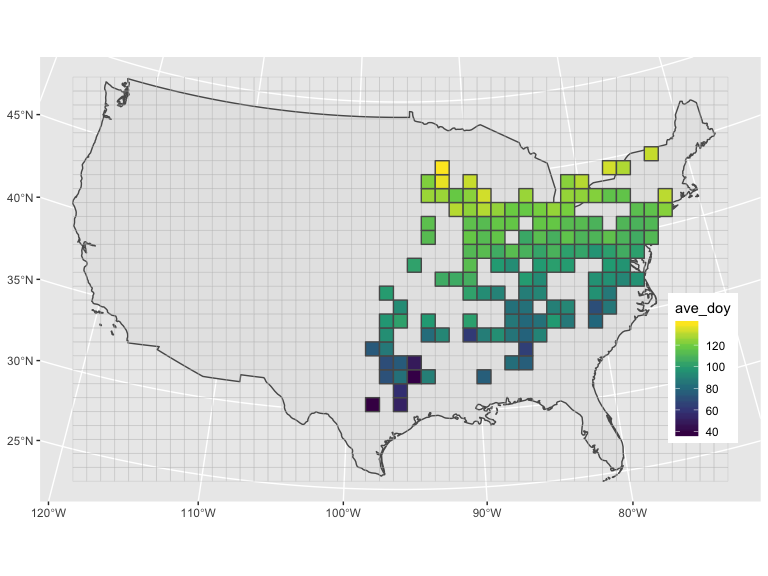

<!-- README.md is generated from README.Rmd. Please edit that file -->

# flower\_duration

We can use the function `plt_summary()` in
[`rcode/00_pkg_functions.R`](rcode/00_pkg_functions.R) to plot the
records, overlay with grid cells that we can specify resolution, and
count the number of cells with enough data.

``` r
d = readr::read_csv("data/Claytonia virginica_inat.csv") %>% 
  dplyr::select(longitude, latitude, everything()) %>% 
  filter(flowers == 1) %>% 
  drop_na(longitude, latitude) %>% 
  rename(id_iNat = id)
#> Parsed with column specification:
#> cols(
#>   id = col_double(),
#>   flowers = col_double(),
#>   scientific_name = col_character(),
#>   observed_on = col_date(format = ""),
#>   latitude = col_double(),
#>   longitude = col_double()
#> )
#> Warning: 15 parsing failures.
#>  row     col expected actual                                file
#> 2118 flowers a double      U 'data/Claytonia virginica_inat.csv'
#> 2308 flowers a double      U 'data/Claytonia virginica_inat.csv'
#> 2477 flowers a double      U 'data/Claytonia virginica_inat.csv'
#> 2524 flowers a double      U 'data/Claytonia virginica_inat.csv'
#> 2600 flowers a double      U 'data/Claytonia virginica_inat.csv'
#> .... ....... ........ ...... ...................................
#> See problems(...) for more details.

cell_100k = plt_summary(cell_size = 100000, dat = d, n_per_cell = 10)
#> 141 cells with records more than 10
```

To get the grid cells with enough records specified by `n_per_cell`
argument:

``` r
filter(cell_100k$cells_with_data, enough_data)
#> Simple feature collection with 141 features and 5 fields
#> geometry type:  POLYGON
#> dimension:      XY
#> bbox:           xmin: -253235.9 ymin: -830092.5 xmax: 1946764 ymax: 1069908
#> epsg (SRID):    NA
#> proj4string:    +proj=aea +lat_1=29.5 +lat_2=45.5 +lat_0=37.5 +lon_0=-96 +x_0=0 +y_0=0 +ellps=GRS80 +towgs84=0,0,0,0,0,0,0 +units=m +no_defs
#> First 10 features:
#>    id_cells  n enough_data                       geometry long_cell lat_cell
#> 1       257 11        TRUE POLYGON ((-253235.9 -830092... -98.12156 30.49581
#> 2       259 19        TRUE POLYGON ((-53235.92 -830092... -96.03379 30.51622
#> 3       306 12        TRUE POLYGON ((-53235.92 -730092... -96.03416 31.41551
#> 4       352 59        TRUE POLYGON ((-153235.9 -630092... -97.10201 32.30789
#> 5       353 25        TRUE POLYGON ((-53235.92 -630092... -96.03454 32.31325
#> 6       354 22        TRUE POLYGON ((46764.08 -630092.... -94.96707 32.30854
#> 7       355 13        TRUE POLYGON ((146764.1 -630092.... -93.89985 32.29375
#> 8       359 16        TRUE POLYGON ((546764.1 -630092.... -89.63894 32.13401
#> 9       399 54        TRUE POLYGON ((-153235.9 -530092... -97.11453 33.20422
#> 10      400 20        TRUE POLYGON ((-53235.92 -530092... -96.03494 33.20963
```

To get the raw records that to be used (i.e. fall within cells with
enough data):

``` r
cell_100k$dat_to_use
#> Simple feature collection with 8173 features and 5 fields
#> geometry type:  POINT
#> dimension:      XY
#> bbox:           xmin: -246930.5 ymin: -827406.3 xmax: 1944863 ymax: 1025360
#> epsg (SRID):    NA
#> proj4string:    +proj=aea +lat_1=29.5 +lat_2=45.5 +lat_0=37.5 +lon_0=-96 +x_0=0 +y_0=0 +ellps=GRS80 +towgs84=0,0,0,0,0,0,0 +units=m +no_defs
#> # A tibble: 8,173 x 6
#>    id_iNat flowers scientific_name     observed_on            geometry id_cells
#>  *   <dbl>   <dbl> <chr>               <date>              <POINT [m]>    <int>
#>  1   58129       1 Claytonia virginica 2012-03-14   (1127061 268941.6)      740
#>  2   60878       1 Claytonia virginica 2012-03-18   (1607161 159337.7)      698
#>  3   62915       1 Claytonia virginica 2012-04-06   (1199452 498004.4)      882
#>  4   71851       1 Claytonia virginica 2012-04-29     (1139628 458921)      834
#>  5  229730       1 Claytonia virginica 2013-04-05  (1514004 -38586.48)      603
#>  6  236518       1 Claytonia virginica 2013-04-14   (1179408 485569.1)      882
#>  7  240011       1 Claytonia virginica 2013-04-18   (1201700 497737.7)      882
#>  8  247008       1 Claytonia virginica 2013-04-27   (1309953 383145.3)      836
#>  9  249102       1 Claytonia virginica 2013-04-29   (1169172 491358.7)      882
#> 10  465413       1 Claytonia virginica 2010-04-10  (676948.7 532757.4)      877
#> # … with 8,163 more rows
```

To see the plot:

``` r
cell_100k$fig
```

<!-- -->

To plot the summarized data of 2019:

``` r
cell_100k$fig_base +
  geom_sf(data = mutate(cell_100k$dat_to_use, observed_yr = lubridate::year(observed_on),
                        observed_doy = lubridate::yday(observed_on)) %>% 
            st_drop_geometry() %>% 
            filter(observed_yr %in% c(2019)) %>% 
            group_by(observed_yr, id_cells) %>% 
            summarise(ave_doy = mean(observed_doy, na.rm = T)) %>% 
            left_join(cell_100k$grids, by = "id_cells") %>% 
            st_sf(), 
          aes(fill = ave_doy)) +
  scale_fill_viridis_c() +
  theme(legend.position = c(0.92, 0.3))
```

<!-- -->
